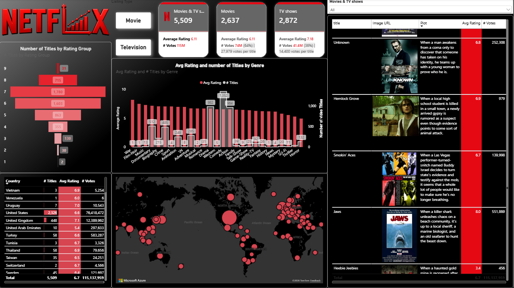

# Netflix Content Analytics Dashboard

An end-to-end Power BI project for analyzing Netflix content using **Power Query**, **DAX**, **data modeling**, **interactive visualizations**, and **Azure Maps**.

## Live Dashboard
[View Interactive Power BI Dashboard](https://app.powerbi.com/view?r=eyJrIjoiMWY1MmM0ZDUtOWNiNC00OWZmLThlMjAtNjc1MTg2MGY4N2RiIiwidCI6ImVhZjYyNGM4LWEwYzQtNDE5NS04N2QyLTQ0M2U1ZDc1MTZjZCIsImMiOjh9)

## Repository
[GitHub Repository](https://github.com/marwanmahmoud-afk/netflix-power-bi-analytics)

---

## Project Overview
This project presents an interactive Power BI dashboard built to analyze Netflix content across multiple dimensions such as:

- Total titles
- Movies vs TV shows
- Average ratings
- Votes and engagement
- Genre performance
- Country contribution
- Geographic distribution
- Title-level analysis

The goal of the project is to demonstrate an end-to-end BI workflow, starting from data preparation and modeling, through DAX calculations, and ending with interactive business reporting.

---

## Dashboard Preview

### Full Dashboard

### KPI Section

### Detailed Analysis

<!-- Optional -->
<!--
### Data Model

-->

---

## Tools & Technologies
- Power BI
- Power Query
- DAX
- Data Modeling
- Azure Maps
- Interactive Slicers & Filters

---

## Key Features
- Interactive KPI cards for total titles, movies, and TV shows
- Reference labels for average rating and vote analysis
- Funnel chart for rating group distribution
- Genre analysis using combo chart
- Country-level title analysis
- Azure Maps geographic visualization
- Detailed title table with images, votes, and ratings
- Dynamic filtering using slicers

---

## DAX Measures Highlights
Examples of calculations used in the project include:

- Total Titles
- Movie Titles / TV Titles
- Total Votes
- Movie Votes / TV Votes
- Average Rating
- Vote Share %
- Votes per Title

---

## Business Questions Answered
- What is the split between movies and TV shows in the Netflix catalog?
- Which genres contain the highest number of titles?
- Which countries contribute the most Netflix content?
- How do ratings vary across genres?
- Which titles receive the highest audience engagement?

---

## What I Learned
Through this project, I practiced:

- Data cleaning and transformation in Power Query
- Building a semantic model in Power BI
- Creating reusable DAX measures
- Applying conditional formatting
- Designing interactive business dashboards
- Using maps and filters to enhance analysis
- Presenting insights in a clean and professional BI report

---

## Files
- `Netflix_Content_Analytics_PowerBI.pbix`
- Screenshots in `assets/screenshots/`
- README documentation

---

## Author
**Marwan Mahmoud**  
[GitHub](https://github.com/marwanmahmoud-afk)
